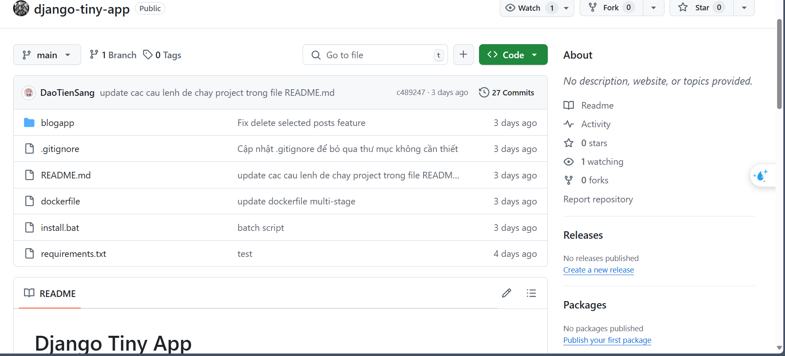

# Release Version 1

## Những thay đổi chính:
- Initial commit: Tạo cấu trúc ban đầu của ứng dụng Django.
- Thiết lập cấu hình cơ bản và cấu trúc thư mục.
- Tạo các file HTML cơ bản cho giao diện.

## Screenshots:
``[Screenshot 1]``()

