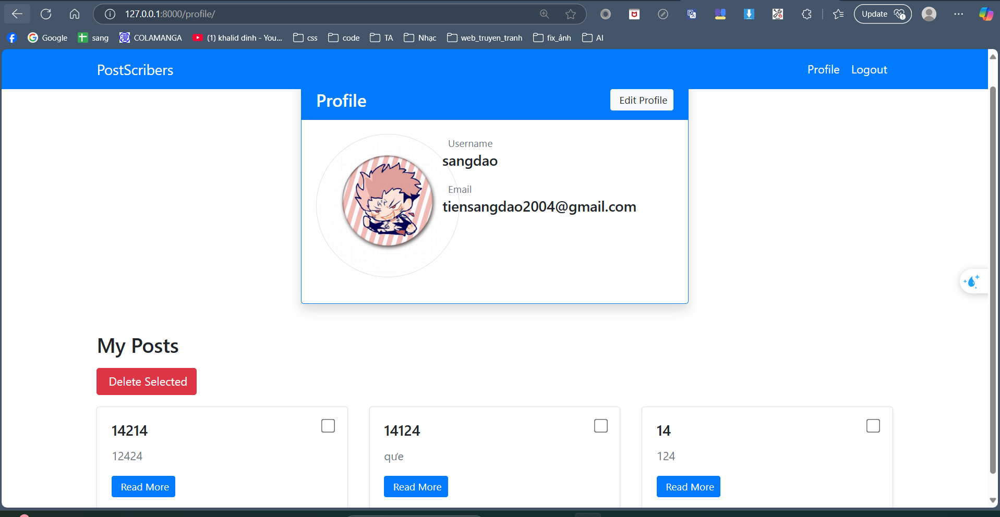
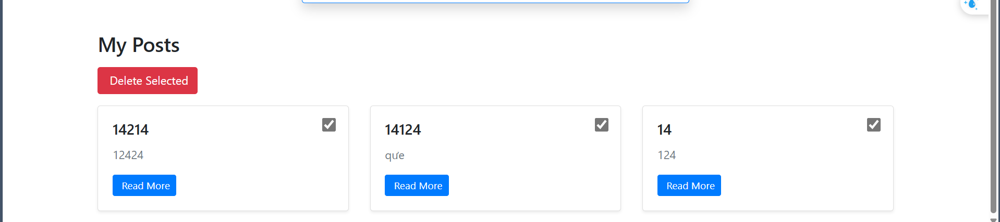

# Phiên bản Phát hành v4

## Tính năng mới:
- **Quản lý Bài viết/Nhiệm vụ:**  
  - Cho phép người dùng quản lý bài viết hoặc nhiệm vụ của riêng họ.
  - Thêm chức năng xóa nhiều bài viết/nhiệm vụ cùng lúc.

## Cải tiến:
- Cải thiện trải nghiệm người dùng với chức năng xóa hàng loạt.
- Cập nhật giao diện hỗ trợ việc chọn và xóa nhiều mục cùng lúc.

## Ảnh chụp màn hình:
- ``[Quản lý Bài viết]``()
- ``[Chức năng Xóa hàng loạt]``()
