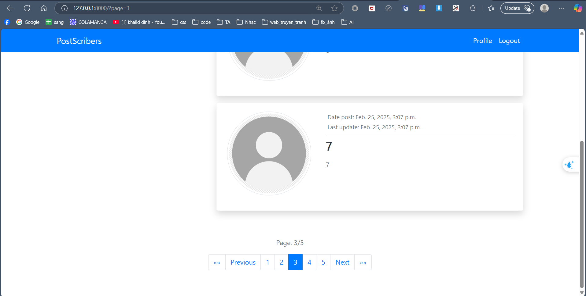

# Phiên bản Phát hành v5

## Tính năng mới:
- **Phân trang:**  
  - Tích hợp chức năng phân trang vào website.
  - Thêm dữ liệu mẫu để mô phỏng phân trang.
  - Mặc định, mỗi trang hiển thị 10 bài viết/nhiệm vụ khi người dùng đăng nhập.

## Cải tiến:
- Tăng hiệu suất và cải thiện trải nghiệm người dùng bằng cách giới hạn số lượng bài viết/nhiệm vụ trên mỗi trang.
- Thêm điều khiển phân trang (Next, Previous, số trang) để điều hướng dễ dàng.

## Ảnh chụp màn hình:
- ``[Ví dụ Phân trang]``()
